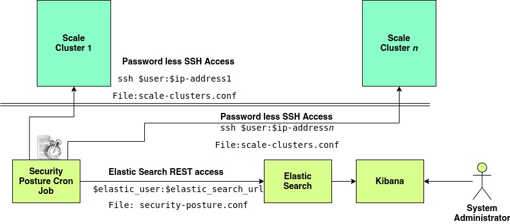
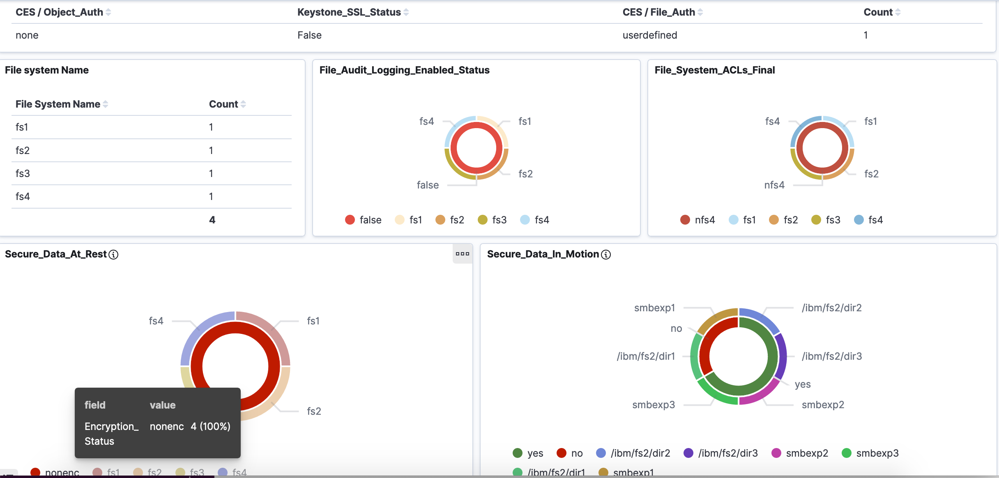
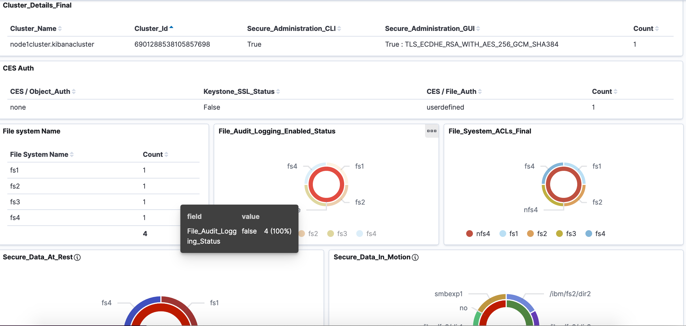

# IBM Spectrum Scale Security Posture
Using security posture project Spectrum Scale cluster's security aspects can be shown in Kibana in graphical representation. This will enable Scale users to quickly identify the loose ends with respect to security and make necessary changes so that all measures are taken.

Multiple Spectrum Scale clusters can be added to the security posture module.

## Architecture
As per below diagram



SecurityPosture module is configured on one of the node from where there is password less ssh access to the Spectrum Scale Clusters.
Which means that below command:

    ssh <USER>@<SPECTRUM_SCALE_IP> hostname


Should run without prompting for password or giving any extraneous text.

## How does this work?
 1. SecurityPosture module iteratively log into the node specified for the Spectrum Scale cluster(s), and runs series of queries in form of Spectrum Scale commands and dumps the cluster state into a JSON file. These commands does NOT affect the cluster state.
 2. With the data it has gatherd, a JSON file is populated and dumped into Elastic Search database
 3. Step #1 and #2 are iteratively performed on all the scale clusters.


## Configuration

Perform following steps to configure the SecurityPosture module:

### Step 1: Clone the project

    git clone https://github.com/IBM/ibm-spectrum-scale-security-posture

If internet connectivity is not available from the datacenter where SecurityPosture module is suppose to be configured, then one can even download the project and copy it to the datacenter. While doing the operation SecurityPosture module does not need internet connectivity.

Note: End user does not need github account, all the repos are anonymously accessible.


### Step 2: Add Scale Clusters
Edit `scale-clusters.conf` and append section pertaining to Spectrum Scale cluster after `[DEFAULT]` section

    [scale-cluster]
    ip-address = <IP_ADDRESS>


Here the scale-cluster as section heading - `[scale-cluster]` is just an identifier for that given Spectrum Scale cluster and it is just for identification purpose of system admistrator.

`ip-address` is one of the admin node of `[scale-cluster]` i.e. from this node SecurityPosture is going to run commands to get the state of cluster.

Optionally if one wants to customize the user with which one needs to login and temp-dir to be used, then add `user` and `temp-dir` variables under `[scale-cluster]` section, just like it is present in the `[DEFAULT]` section.

### Step 3: Install Elastic Search and Kibana
By using below instructions, install Elastic Search and Kibana on one of the node.

Note: For this setup, Logstash is not required.

SecurityPosture node needs to have outbound access to the server where Elastic Search and Kbana is installed, this is because SecurityPosture is going to run REST api and ingest data into Elastic Search.

Install the Elastic and Kibana based on version and flavours of Operating System :

[Elastic Search tar]: (https://www.elastic.co/guide/en/elasticsearch/reference/7.6/install-elasticsearch.html)

[Kibana tar]: (https://www.elastic.co/guide/en/kibana/7.6/install.html)


### Step 4: Configure TLS on Elastic Search and Kibana
Enabling of TLS on Elastic Search and Kibana [steps]: (https://www.elastic.co/blog/configuring-ssl-tls-and-https-to-secure-elasticsearch-kibana-beats-and-logstash)

Note : Since LogStash we are not using and hence in above link configuration is required only till Step #4.

### Step 5: Update security-posture.conf
Edit `security-posture.conf` file and update parameters `elastic_search_url` and `elastic_user`

Here,

1. `elastic_search_url` is in format `https://IPADDRESS:9200`
2. `elastic_user` parameter is in format `USERNAME:BASE64_ENCODED_PASSWORD`

### Step 6. Dry run configure the cron job script:
Below cron job should be configured for repeatedly scanning of the clusters and populating the data in kibana.

```shell
python cronjob.py --config-file security-posture.conf --scale-clusters-config-file scale-clusters.conf
```

Once the above command completes as expected, add the command in `corntab -e`

### Step 7: Add the sample kibana_dashboard.ndjson file into Kibana i.e Login to Kiaban GUI page -> Go to "Management" Section -> Kibana -> Saved Objects -> Click on Import Saved Objects and then upload the kibana_dashboard.ndjson -> Move to Dashboard and look for pictorials.

Note : The pictorials can be changed as per individiual cluster configurations.

#### Here are the few snippets from the cluster:






####CONTRIBUTIONS Following team members has contributed for the realization of the project:

Sandeep Ramesh Patil 

Pushkaraj Balasaheb Thorat

Prayas Gupta

Chetan Kulkarni

Prashant Sodhiya

### Note: The project list easy step of implementation and is  DO-IT-YOURSELF. It is avalaible ‘as is’ with no formal support from IBM. You are also encouraged to continute to continute to the project.

